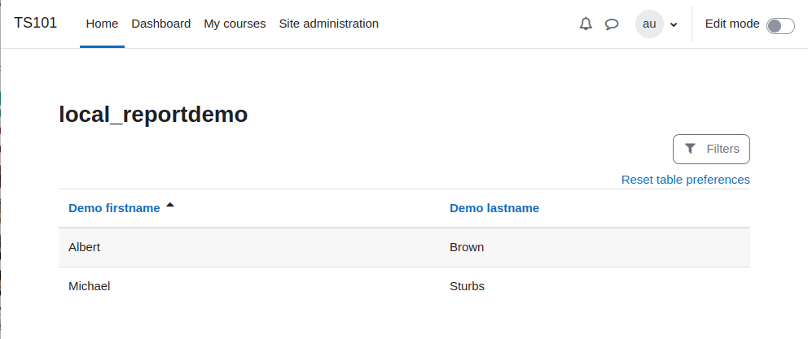

# Report Demo

Demonstration of the reportbuilder functionality delivered with Moodle 4.X in a local plugin. By Marcus Green

Contact Moodle Partner Catalyst EU (https://www.catalyst-eu.net/) for custom development and consultancy.

The following resources were used when creating this

https://github.com/marinaglancy/moodle-tool_courserating/blob/master/index.php#L38
https://docs.moodle.org/dev/Report_builder_API
https://www.youtube.com/watch?v=eoQsxreML_w&t=1494s
https://docs.moodle.org/dev/Developer_meeting_December_2021

The API is documented here
https://moodledev.io/docs/apis/core/reportbuilder
